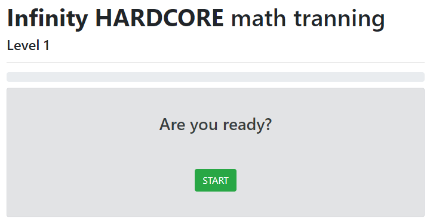
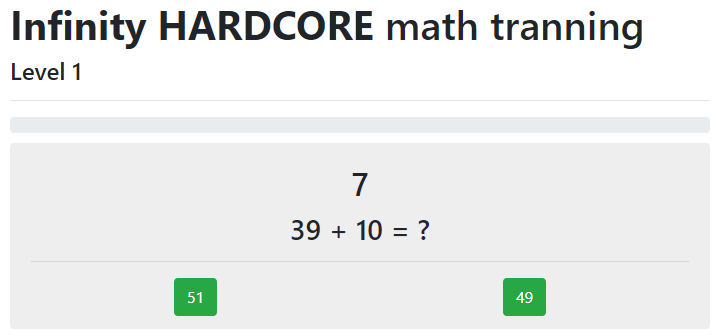
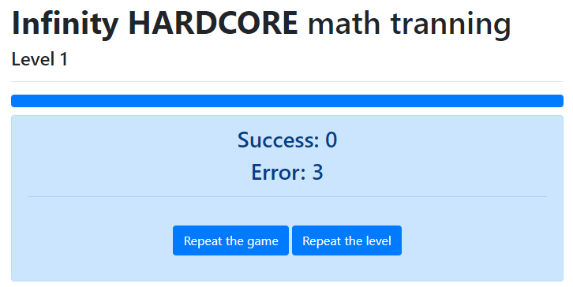

# Start screen

# Question screen
(The first level) <br>
3 rounds <br>
Sidebar <br>
Timer 10** sec <br>
Question numbers from 10* to 40* <br>
Variants of the answer 2* <br>
*will change in the new level <br>
**min time in the level == 5 <br>

# Result screen
If right (success) answers > wrong (error) answers, it will level up


## CLI
# tranning

> A Vue.js project

## Build Setup

``` bash
# install dependencies
npm install

# serve with hot reload at localhost:8080
npm run dev

# build for production with minification
npm run build

# build for production and view the bundle analyzer report
npm run build --report
```

For a detailed explanation on how things work, check out the [guide](http://vuejs-templates.github.io/webpack/) and [docs for vue-loader](http://vuejs.github.io/vue-loader).
